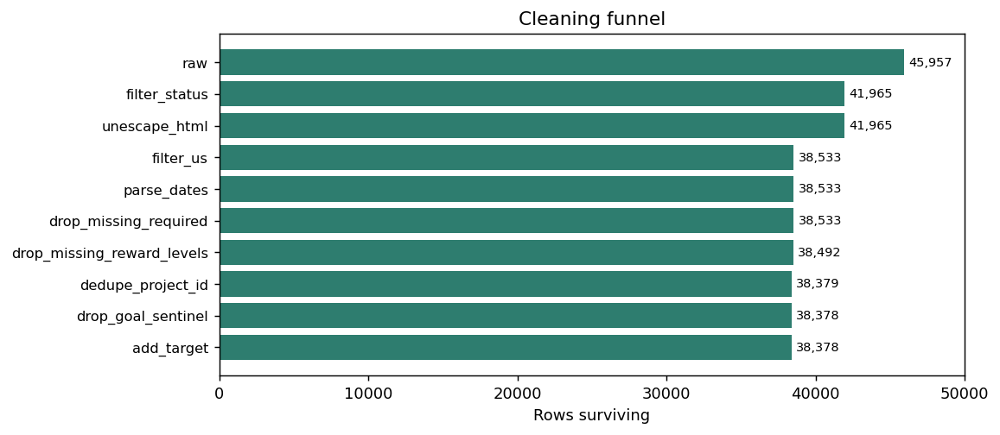
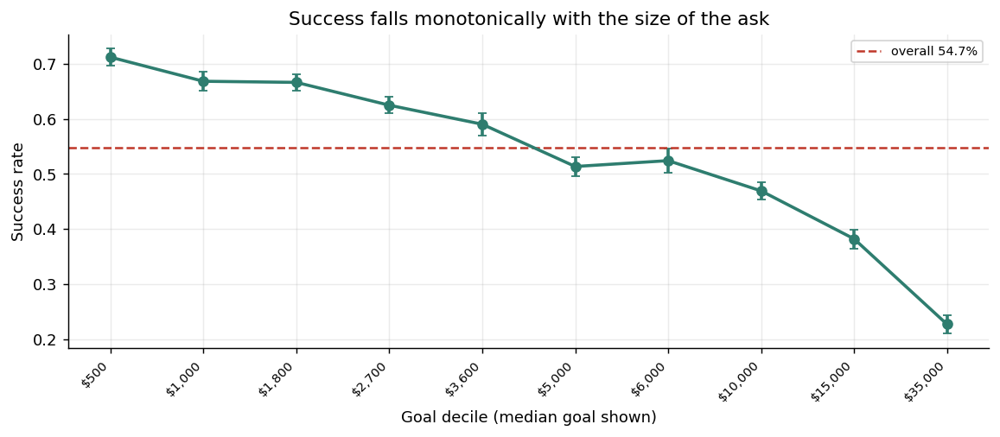
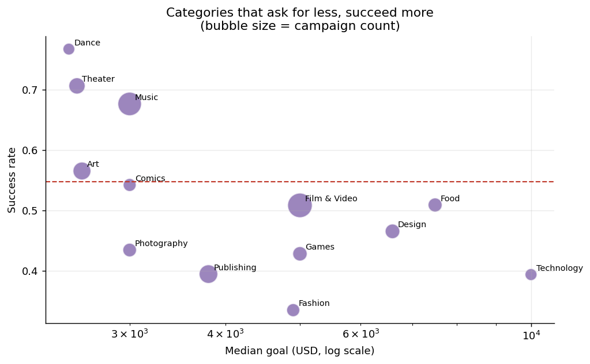
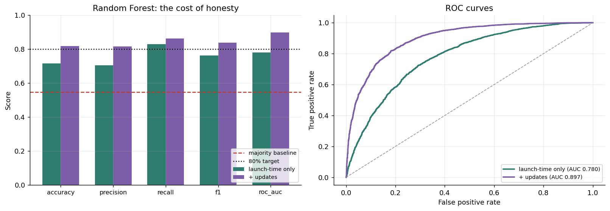
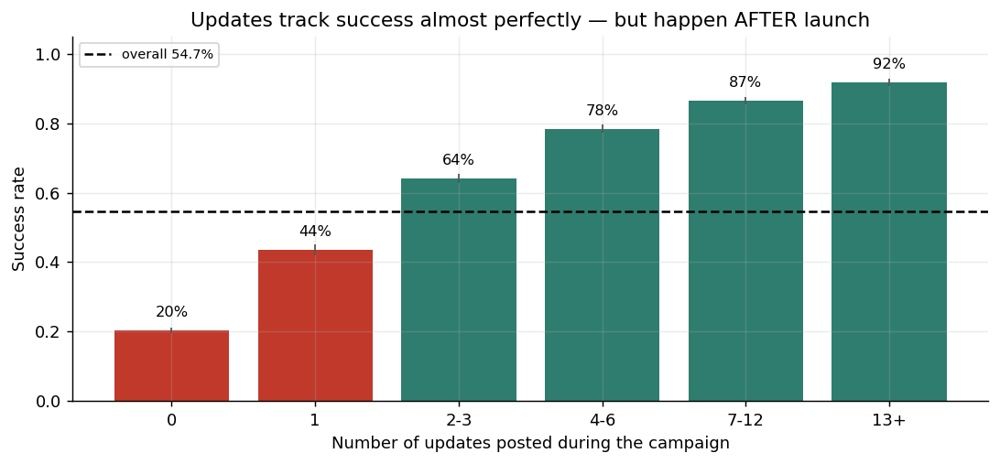
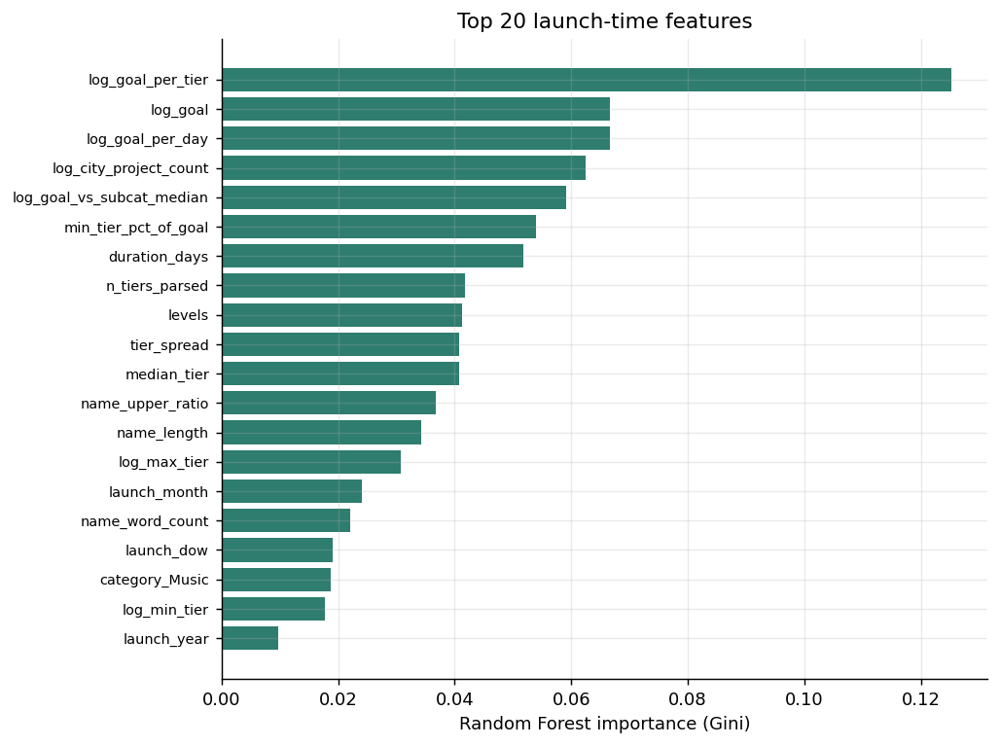

# Kickstarter Crowdfunding Recommendation Engine

Predicting whether a Kickstarter campaign will succeed or fail from
information available **at launch**, and turning the drivers of success into
actionable advice for creators.

Break Through Tech AI Studio — Fall 2026
Challenge Advisor: Neha Panchal · AI Studio Coach: Darshan Ugale

> **Status:** Milestones 1 and 2 complete. Milestone 3 (modelling) and
> Milestone 4 (recommendation prototype) in progress.

---

## Team Members

| Name | GitHub Handle | Contribution |
|------|---------------|--------------|
| _your name_ | _@handle_ | Data preparation, EDA, feature engineering, modelling |

---

## Project Highlights

- Built a reproducible preprocessing pipeline that reduces the raw 45,957-row
  Kickstarter scrape to a **38,378-row** modelling table, with every
  transformation logged and row-counted.
- Found and fixed a **HTML-entity encoding bug** in the source data that
  silently split the platform's largest category (`Film &amp; Video` vs
  `Film & Video`) into two separate categories.
- **Reproduced the published 80.2% / F1 0.834 benchmark** (81.8% / 0.838) —
  and then showed it depends almost entirely on `updates`, a variable that
  does not exist at campaign launch.
- Established an honest **pre-launch baseline of ~71.5% accuracy**, and framed
  the project as two distinct products rather than one inflated number.

---

## Setup and Installation

```bash
git clone https://github.com/<your-org>/State-Street-1B-kickstarter-crowdfunding-recommendation-engine.git
cd State-Street-1B-kickstarter-crowdfunding-recommendation-engine

python -m venv .venv
source .venv/bin/activate        # Windows: .venv\Scripts\activate
pip install -r requirements.txt

jupyter lab
```

The raw dataset zip is committed to `data/`, so no Kaggle login is needed.
Run the notebooks **in order** — 02 writes the parquet file that 03 reads,
and 03 writes the splits that 04 reads.

```
notebooks/01_inspection.ipynb    Task 1 — inspect the raw data
notebooks/02_cleaning.ipynb      Task 2 — filter, clean, validate
notebooks/03_features.ipynb      Task 3 — engineer and encode features
notebooks/04_eda.ipynb           Tasks 4 & 5 — EDA, charts, baselines
```

### Repository layout

```
src/loading.py      Raw load: encoding handling, column normalisation
src/cleaning.py     Filter → clean → validate, with an auditable step log
src/features.py     Feature engineering, leakage register, feature sets
notebooks/          One notebook per milestone task
data/               Raw zip (committed) + derived parquet (gitignored)
reports/            Step log, EDA tables, baseline results
reports/figures/    All generated charts
```

Cleaning and feature logic lives in `src/`, not in the notebooks. There is
exactly one definition of "the modelling table" in this project, imported by
three notebooks, so they cannot quietly disagree about what the data is.

---

## Project Overview

Crowdfunding is high-stakes and unforgiving: Kickstarter is all-or-nothing,
so a campaign that raises 99% of its goal returns every dollar and the
creator gets nothing. Roughly **45% of resolved campaigns in this dataset
failed**. A creator therefore has to make a handful of irreversible decisions
— how much to ask for, how long to run, how to structure rewards — before any
feedback exists.

That framing sets the requirement: the model has to work from information
available **at launch**, or it cannot inform those decisions. This turned out
to be the central methodological question of the project (see
[Key Findings](#results--key-findings)).

---

## Data Exploration

**Source:** [Kickstarter dataset on Kaggle](https://www.kaggle.com/parienza/kickstarter)
**Raw size:** 45,957 campaigns × 17 columns
**Coverage:** April 2009 – May 2012, US and international
**Final modelling table:** 38,378 campaigns × 56 features (13 categories,
49 subcategories, 51 states, 3,153 cities)

### Data quality issues found

| # | Issue | Resolution |
|---|---|---|
| 1 | File is neither UTF-8 nor cp1252 (bytes `0x92`, `0x8f`) | Load with `encoding="latin-1"` |
| 2 | `Film &amp; Video` and `Film & Video` are separate categories | `html.unescape()` **before** any grouping — 14 → 13 categories, 51 → 49 subcategories |
| 3 | 142 duplicated `project_id` values | Deduplicate on the platform's own primary key |
| 4 | Max goal is $21,474,836.47 = 2³¹−1 cents | Integer overflow artefact; row dropped |
| 5 | 8 malformed `location` values; Montana appears as both `MT` and `Mt` | `rsplit(",", 1)` + **case-insensitive** 56-entry US whitelist |
| 6 | `funded_date` is the campaign **end** date, not launch | Recovered `launch_date = funded_date − duration` |
| 7 | `reward_levels` has commas *inside* amounts (`$1,000`) | Comma-aware regex; validated at **100%** agreement with the scraper's own `levels` column |
| 8 | Nulls in `location`, `reward_levels`, `pledged` | `dropna` on modelling columns only — `pledged` is a leaky outcome |

### Validation

- **Benchmark recipe reproduced.** Applying the original project's filters
  yields 38,492 rows against their stated 38,491 — a single row apart.
  Reaching that required matching state codes case-insensitively; an
  exact-case whitelist silently drops 36 Montana campaigns and lands 28 rows
  short. Confirming this *before*
  deviating means our changes are distinguishable from our mistakes.
- **Labels are trustworthy.** `status` and `funded_percentage` agree on
  99.98% of rows; only 3 rows contradict, all scrape-timing artefacts.
- **Three documented deviations** cost 114 rows (0.30%). The important one is
  deduplication — the original project kept 113 duplicate scrapes, which
  would place the same campaign in both train and test.

### EDA insights



| Rank | Factor | Effect on success | Known at launch? |
|---|---|---|---|
| 1 | **Updates** | 20% → 92% from 0 to 13+ updates | ❌ **No** |
| 2 | **Goal** | Monotonic decline across all 10 deciles | ✅ Yes |
| 3 | **Subcategory** | Very wide spread, wider than category | ✅ Yes |
| 4 | **Reward tiers** | More tiers and a low entry price both help | ✅ Yes |
| 5 | **Duration** | Longer is *worse*; the 30-day default wins | ✅ Yes |
| 6 | **Category** | Real effect, survives controlling for goal | ✅ Yes |
| 7 | **Location** | Modest — a few points between best/worst states | ✅ Yes |



**Goal is the strongest launch-time signal**, and the shape matters as much as
the direction: the decline is steep below ~$20k and flattens above it, which
is what makes goal-setting advice actionable.



**We controlled for the obvious confound.** Dance and Theater post excellent
success rates — but they also ask for far less money. Comparing categories
*within* goal quartiles shows the category ordering largely survives, so both
effects are real and neither explains the other away.

**Duration runs against intuition:** longer campaigns do *worse*. Median
duration is 31 days for successful campaigns and 35 for failed ones. A long
window signals low confidence; momentum matters more than time.

### Assumptions and caveats

1. Gini feature importance is biased toward continuous and high-cardinality
   features — Milestone 3 will use permutation importance or SHAP.
2. The reward-tier features are multicollinear; regularise the Logistic
   Regression or drop the duplicate of `levels`.
3. The current split is random and stratified. Since `launch_date` was
   recovered, Milestone 3 should also report a **chronological** split, which
   matches the deployment scenario.
4. The data spans 2009–2012, including Kickstarter's June 2011 change capping
   campaigns at 60 days (11% of rows predate it). `launch_year` partly
   absorbs this drift, but the model should not be assumed valid for
   present-day Kickstarter.

---

## Model Development

> Milestone 3 in progress. The baselines below come from `04_eda.ipynb` and
> exist to quantify the leakage question, not as final models.

Two feature sets are exported from `src/features.py`, differing **only** in
whether `updates` is included:

- **`launch_only`** — goal, duration, reward-tier statistics, category,
  subcategory, state, city density, launch timing, title features.
- **`plus_campaign`** — the above plus `updates`.

`src/features.py` maintains an explicit **leakage register**, and
`build_model_matrix()` raises if a registered leaky column is ever requested.
`pledged`, `backers`, `funded_percentage` and `comments` are all excluded;
`funded_percentage` in particular *mechanically determines* the target.

---

## Results & Key Findings

### Baseline results (20% held-out test set, stratified)

| Feature set | Model | Accuracy | Precision | Recall | F1 | ROC-AUC |
|---|---|---|---|---|---|---|
| — | Majority class | 0.548 | — | — | — | — |
| `launch_only` | Logistic Regression | 0.716 | 0.717 | 0.794 | 0.754 | 0.777 |
| `launch_only` | Random Forest | 0.715 | 0.704 | 0.828 | 0.761 | 0.780 |
| `plus_campaign` | Logistic Regression | 0.816 | 0.825 | 0.841 | 0.833 | 0.894 |
| `plus_campaign` | Random Forest | **0.818** | 0.816 | 0.862 | **0.838** | 0.897 |
| _benchmark_ | _Random Forest (original project)_ | _0.802_ | — | — | _0.834_ | — |



### The headline finding

**The published benchmark is reproducible, and it is essentially one
feature.** Random Forest reaches 81.8% with `updates` and 71.5% without it.



`updates` counts creator posts made *during* the campaign. Its relationship
with success is dramatic — 20% at zero updates, 92% at thirteen or more — but
the causal arrow points at least partly backwards: a campaign that is visibly
funding well attracts a creator who keeps posting, while a stalling campaign
goes quiet. And by construction none of it exists at the moment a creator
needs the prediction.

A model built on `updates` cannot answer *"should I launch this, like this,
today?"*

### The reframing

We therefore report **two products** rather than one number:

- **Pre-launch model** (`launch_only`) — the real deliverable, ~71.5% accuracy.
  Every feature is something a creator can change *before* launching, which
  is what makes the Milestone 4 recommendation prototype possible at all.
- **Mid-campaign model** (`plus_campaign`) — a legitimately useful second
  product for triaging campaigns already running, and the honest way to
  reproduce the 80% benchmark. Reported with an explicit note that it is not
  a pre-launch predictor.



---

## Next Steps

- **Milestone 3:** gradient boosting (XGBoost/LightGBM), hyperparameter
  tuning, permutation importance and SHAP, and a chronological train/test
  split alongside the random one.
- **Milestone 4:** translate the pre-launch model into recommendations, using
  the features a creator actually controls — goal, duration, and reward
  structure. "Your $40k / 60-day Documentary has a 22% predicted success
  rate; comparable campaigns at $15k / 30 days succeed 48% of the time."
- **Closing the pre-launch gap** requires signal this scrape does not
  contain: campaign description text, video presence, image count, creator
  history, and social following. This is the strongest argument for
  supplementing the dataset.
- **Fairness:** check whether the model systematically under-predicts for
  campaigns from low-density cities, which would make a recommendation
  engine's advice worse for creators outside established creative hubs.

---

## License

This project is licensed under the MIT License.

---

## References

- [Kickstarter dataset on Kaggle](https://www.kaggle.com/parienza/kickstarter)
- [Predicting the Success of Kickstarter Campaigns](https://towardsdatascience.com/predicting-the-success-of-kickstarter-campaigns-3f4a976419b9)
- [scikit-learn documentation](https://scikit-learn.org/stable/)

---

## Acknowledgements

Thanks to Challenge Advisor Neha Panchal and AI Studio Coach Darshan Ugale
for guidance throughout this project.
